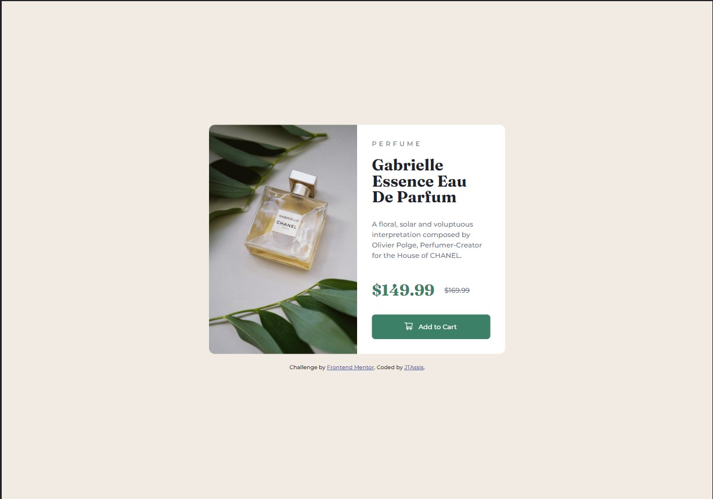
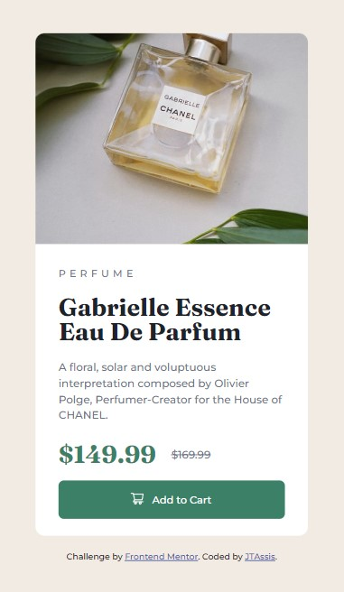

# Frontend Mentor - Product preview card component solution

This is a solution to the [Product preview card component challenge on Frontend Mentor](https://www.frontendmentor.io/challenges/product-preview-card-component-GO7UmttRfa). Frontend Mentor challenges help you improve your coding skills by building realistic projects. 

## Table of contents

- [Overview](#Overview)
  - [The challenge](#the-challenge)
  - [Screenshot](#screenshot)
  - [Links](#links)
- [My process](#my-process)
  - [Built with](#built-with)
  - [Continued development](#continued-development)
  - [Useful resources](#useful-resources)
- [Author](#author)
- [Acknowledgments](#acknowledgments)

### The challenge

Users should be able to:

- View the optimal layout depending on their device's screen size
- See hover and focus states for interactive elements

### Screenshot

### Links

[🔗 Clique aqui para acessar](https://jtassis.github.io/product-preview-card)

### 🛠️ Built with

- Semantic HTML5 markup
- CSS custom properties
- Flexbox
- CSS Grid
- Mobile-first workflow

### Continued development

I want to continue focusing on more of this type project in the future. Learn more about it, and continue to upgrade my knowledge on: HTML and CSS, and in the future learn JS. For now i want to be completely comfortable with this techniques and refine it.

### Useful resources

- [MDN](https://developer.mozilla.org/en-US/docs/Web/CSS/Media_Queries/Using_media_queries) - This helped me lot, because i never use it @media and will use it going forward.
- I watch many different types of video about too.

## Author

- Website - [JTAssis](https://github.com/JTAssis)
- Frontend Mentor - [@JTAssis](https://www.frontendmentor.io/profile/JTAssis)
- Twitter - [@JhonathanA96](https://twitter.com/JhonathanA96)

## Acknowledgments

I want to thank to [@lirarood](https://www.instagram.com/lirarood/), my friend to all advices, without him, i would have more difficulty to finish haha.

